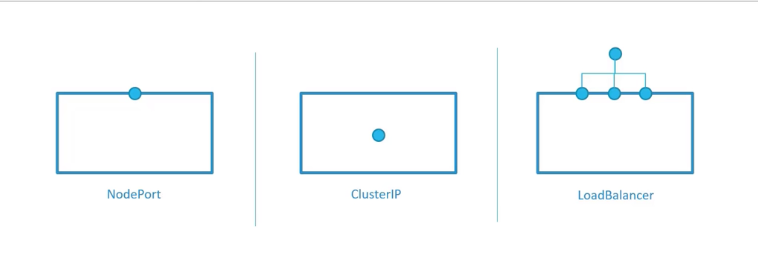
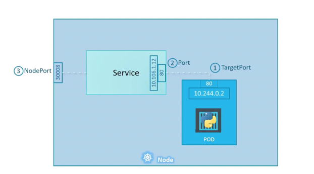
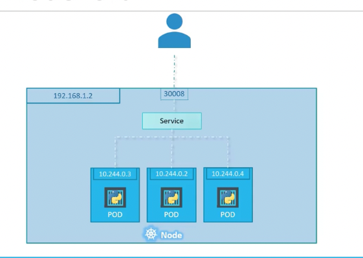
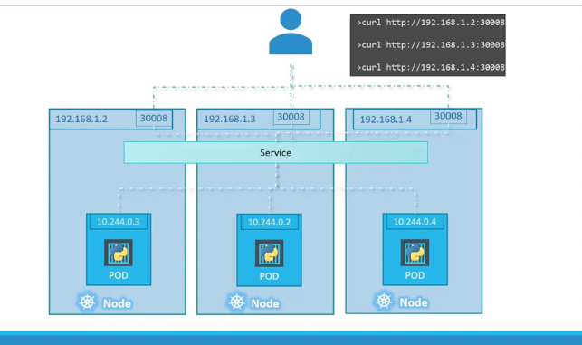
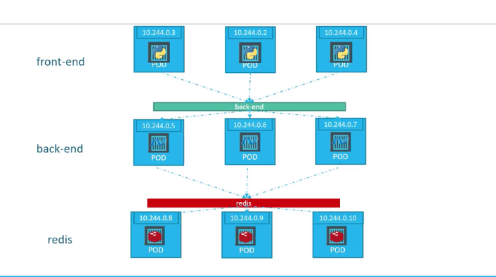
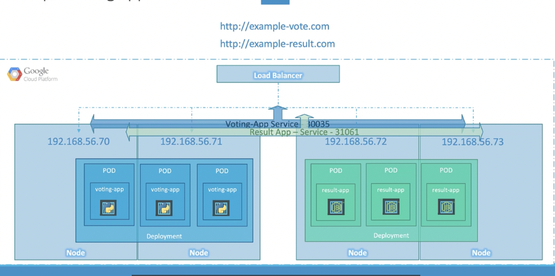
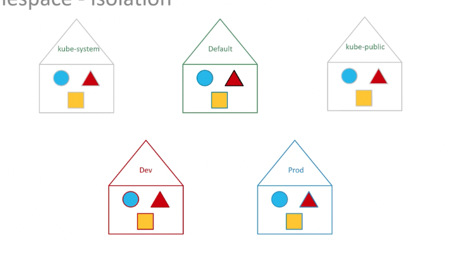
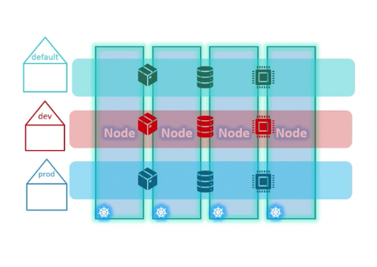

# Service



## 1. node port



```yml
apiVersion : v1
kind : Service
metadata : 
    name : myapp-service
spec : 
    type : NodePort 
    ports :
        - targetPort : 80
        port : 80
        nodePort : 30008
    selector : #포드를 지정해주는 부분
        app : myapp #포드의 label 부분을 가져온다.
        type : front-end
```
- 지정된 포드의 yml 파일

    ```yml
        apiVersion : v1
        kind : Pod

        metadata :
            name : myapp-pod
            labels : #서비스 yml 파일에 명시되어야 할 부분
                app : myapp 
                type : front-end
        
        spec :
            containers:
                - name : nginx-container
                image : nginx
    ```

      
이런식으로 로드밸런싱하는데 많이 쓴다
- 로드밸런싱 알고리즘 : 랜덤

   
이렇게도 많이 씀


## 2. cluster ip



```yml
apiVersion : v1
kind : Service
metadata : 
    name : back-end
spec :
    type : ClusterIP
    ports :
        - targetPort : 80
        port : 80 
    selector : 
        app : myapp
        type : back-end
```

## 3. load balancer



```yml
apiVersion : v1
kind : Service
metadata : 
    name : myapp-service
spec : 
    type : LoadBalancer
    ports :
        - targetPort : 80
        port : 80
        nodePort : 30008
    selector : #포드를 지정해주는 부분
        app : myapp #포드의 label 부분을 가져온다.
        type : front-end
```

# NameSpace




```yml
apiVersion : v1
kind : Namespace
metadata : 
    name : dev
```


```yml
        apiVersion : v1
        kind : Pod

        metadata :
            #namespace 지정
            namespace : dev
            name : myapp-pod
            labels :
                app : myapp 
                type : front-end
        
        spec :
            containers:
                - name : nginx-container
                image : nginx
```
이런식으로 pod 마다 namespace를 지정해줄수있음 

## Resource quota (namespace 리소스 할당)



```yml
apiVersion : v1
kind : ResourceQuota
metadata : 
    name : compute-quota
    namespace : dev
spec : 
    hard :
        pods : "10"
        requests.cpu : "4"
        requests.memory : 5Gi
        limits.cpu : "10"
        limits.memory : 10Gi
```
