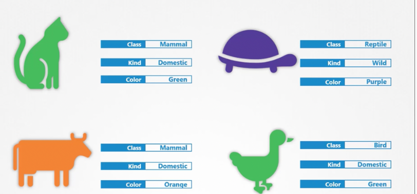
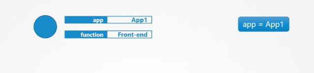
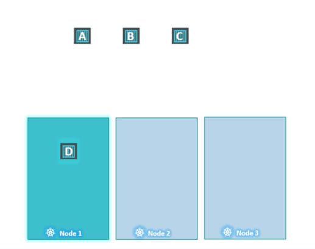
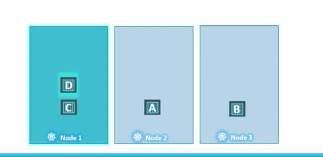
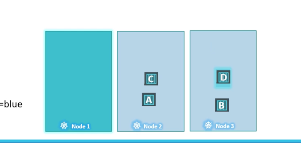
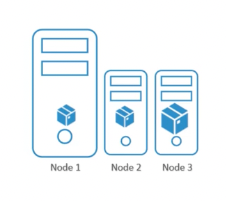

## 스케줄링


```yaml
apiVersion: v1
kind: Pod
metadata:
  name: nginx
spec:
 #이런식으로 pod 에 node를 지정할수있다.
  nodeName : node1
  containers:
  -  image: nginx
     name: nginx
```


## Labels & selector


#### Label

이런식으로 속성을 추가할수 있음


```yaml
apiVersion : v1
kind : Pod
metadata :
    name : simple-webapp
    labels :
        ## Key - Value로 Label 지정
        app : App1
        function : Front-end
```

#### selector 

속성을 토대로 필터링 가능

```shell
kubectl get pods --selector app=App1  #이런식으로 필터링 가능
```

#### label과 selector를 이용해 서로 다른 객체들 연결하기

```yaml
apiVersion : apps/v1
kind : ReplicaSet
metadata :
    name : simple-webapp
    labels :  # 이 라벨은 pod의 라벨이 아닌 Replicaset의 라벨이다
        app : App1
        function : Front-end
spec :
    replicas : 3
    selector :
        # 라벨로 필터링 (포드의 라벨), 하단과 동일해야함
        matchLabels :
            app : App1
    template :
        metadata : 
            labels :
                app : App1
```

* kubectl run bee --image=nginx --dry-run=client -o yaml

## pod & node

  

pod는 node에 배치됨     
node마다 특정 pod에 친하게 만들수 있고, pod마다 특정 node에 친하게 만들 수도 있다.  

node 마다 특정 pod를 친하게 만드는것 -> Taints - Node
```shell
kubectl taint nodes node-name key=value:taint-effect
#tain-effect는 pod가 node를 만족시키지 못하면 무슨 일이 생길지 정의
#NoSchedule | PreferNoSchedule | NoExecute(실행불가) 중 정의
```
```shell
kubectl tain nodes node1 app=blue:NoSchedule
```

pod 마다 특정 node를 친하게 만드는것 -> Tolerations - PODs
```yaml
apiVersion :
kind : Pod
metadata :
    name : myapp-pod
spec :
    containers :
        - name : nginx-container
        image : nginx
    tolerations : 
        - key : app
        operator : "Equal"
        value : blue
        effect : NoSchedule
```


   
원래 실행되던 node1 에 taint가 생기고 , pod D에 toleration이 생기면 C는 방출당함



pod D 는 node1과 친한것이지, node1로 간다는 보장이 생기는 것은 아니므로
위와같은 현상이 생길수있음     
무조건 node1로 가게 하고 싶으면 Node Selector라는 개념을 적용해야함


## 포드에 한계를 지정하는법



효과적인 자원 분배를 위해 , 포드에 한계를 지정할 수 있음

1. Node Selector

pod.yaml
```yaml
apiVersion :
kind : Pod
metadata :
    name : myapp-pod
spec :
    containers :
        - name : data-processor
        image : data-processor 
    nodeSelector :
    # size - Large는 node의 Label에 정의된 key-value값이다.
        size : Large
```

- node에 라벨 붙이기
    ```shell
    kubectl label nodes node01 size=Large
    ```

