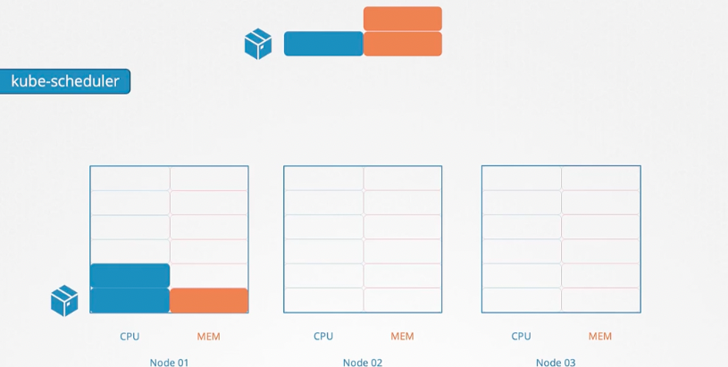
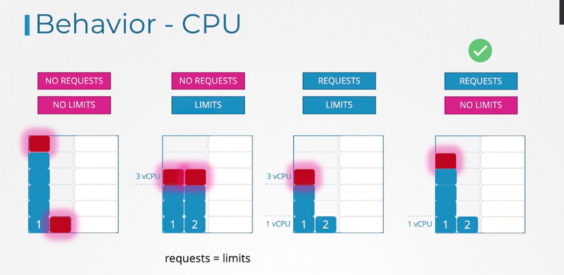
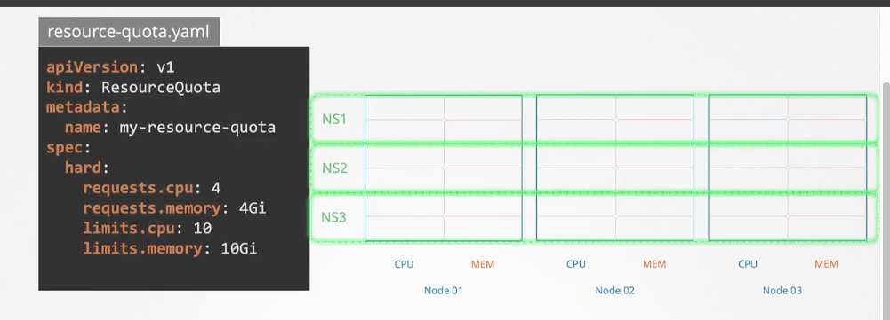
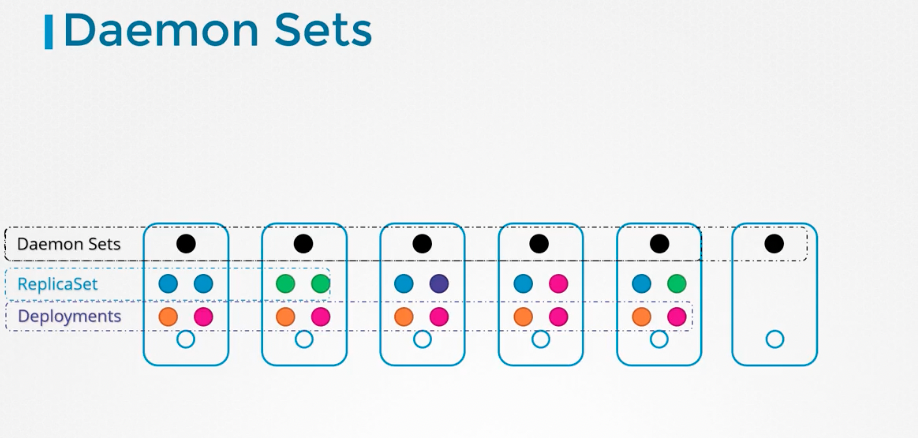

## 자원 할당 (Request vs Limit)
pod에 필요한 CPU의 갯수와 메모리를 설정할 수 있다. 그것을 근거로 node에 할당된다.




```yaml
apiVersion : v1
kind : Pod
metadata : 
    name : simple-webapp-color
    labels :
        name : simple-webapp-color
spec :
    containers :
    - name : simple-webapp-color
    image : simple-webapp-color
    ports : 
        - containerPort : 8080
    # 리소스 할당
    resource : 
        # 이정도를 수용할수 있는 자원이 있는 node 에 할당, 이정도의 자원이 제공된다는 뜻
        requests :
            memory : "4Gi"
            cpu : 2
        # Pod 가 사용하는 자원을 제한
        # 메모리를 이 이상 쓰면 Out Of Memory 에러가 난다.
        limits :
            memory : "2Gi"
            cpu : 2
```

1cpu = 1 aws vCPU = 1 GCP Core = 1 Azure Core = 1 Hyperthread

#### cpu의 request와 limit


1번째 케이스는 request가 없어 1번 pod가 node 의 자원을 독식하고 있다.    
2번 케이스는 request만 설정되어 있는데 , 이 경우 k8s가 limit또한 request값으로 동일하게 여긴 모습이다.   
3번째 케이스의 경우 , 1번 pod에 limit가 걸려 있어 2번 pod가 cpu를 많이 사용하지 않음에도 불구하고, cpu를 제한적으로 사용하는 모습이다.   
반면 4번째 케이스는 limit가 걸려있지 않아 1번 pod가 cpu를 풍족하게 쓰고 있다.

#### Memory의 request와 limit
memory가 cpu 와 다른 점은 , memory 는 limit 조건을 넘어가면 pod에서 out out memory 에러가 난다. 


#### 기본 설정
```yaml
apiVersion : v1
kind : LimitRange
metadata : 
    name : cpu-resource-constraint
spec :
    limits :
    # 특정 한도 없이 생성된 container에 부여되는 기본 설정
        - default : #limit
            cpu : 500m
        defaultRequest : #request
            cpu : 500m
        max : #limit
            cpu : "1"
        min : #request
            cpu : 100m
        type : Container
```

#### namespoace quota
namespace level의 객체로 제한을 설정한다.



```yaml
apiVersion : v1
kind : ResourceQuota
metadata : 
    name : my-resource-quota
spec :
    hard :
        requests.cpu : 4
        requests.memory : 4Gi
        limits.cpu : 10
        limits.memory : 10Gi
``` 


## Demon Sets


demon set은 node마다 하나씩 존재하면서 , 새로운 node가 생성되면 같은 포드 복제본이 자동으로 하나 추가된다. cluster 내 모든 node에 해당 pod가 무조건 존재하기 해준다.    
만드는법은 replicaset과 비슷하다.

```yaml
apiVersion : apps/v1
kind : ReplicaSet
metadata :
    name : monitoring-daemon
spec :  
    selector :
        matchLabels :
            app : monitoring-agent
        template :
            metadata :
                labels :
                    app : monitoring-agent
            spec :
                containers:
                -name : monitoring-agent
                image : monitoring-agent
```


```yaml
apiVersion : apps/v1
kind : DemonSet
metadata :
    name : monitoring-daemon
spec :  
    selector :
        matchLabels :
            app : monitoring-agent
        template :
            metadata :
                labels :
                    app : monitoring-agent
            spec :
                containers:
                -name : monitoring-agent
                image : monitoring-agent
```


